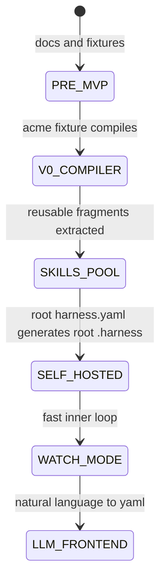

# harness-kit Architecture

## System Overview

harness-kit is a local compiler and content system for project process docs. A user writes or generates `harness.yaml`; the compiler resolves local **plugins** (self-contained bundles that may ship skills / agents / hooks / docs / a permissions block) plus per-project references; then it emits a deterministic `.harness/` folder into the target project.

## High-Level Architecture

```text
Natural language intent
        |
        | optional LLM frontend — reads plugins/*/README.md to pick plugins
        v
  harness.yaml  (preset + project identity + contract + references + extras)
        |
        | deterministic compiler
        v
 +-------------------------------------------------+
 | load                                            |
 |   parse + zod-validate                          |
 | resolve                                         |
 |   preset -> plugin id list                      |
 |   merge extras.plugins                          |
 |   walk plugins/<id>/{skills,agents,hooks,docs,  |
 |     permissions.json} for every enabled plugin  |
 |   resolve extras.{skills,agents,hooks} (each    |
 |     entry is "<plugin>:<name>")                 |
 |   resolve references (pool id or path)          |
 | render                                          |
 |   eta-render docs with stack/contract params    |
 |   aggregate skills -> SKILLS.md                 |
 |   copy agents; merge permissions + hooks +      |
 |     plugin list into settings.example.json      |
 | emit                                            |
 |   write file map; never delete unrelated files  |
 +-------------------------------------------------+
        |
        v
    .harness/

Local content directories:

plugins/<id>/      -> self-contained bundles (any of: README.md, skills/, agents/, hooks/, docs/, permissions.json)
references-pool/   -> shared raw LLM-readable reference files
presets/<name>.ts  -> named plugin id lists (post-v0; hardcoded in compiler for v0)
```

## Core Flow

```text
User or LLM writes harness.yaml
  -> load: read yaml, parse, validate with zod
  -> resolve: expand preset to plugin id list, walk each plugin for its
              sub-resources, resolve references
  -> render: eta-render docs, aggregate skills, merge permissions + hooks,
             compose settings.json
  -> emit: write files under outDir without deleting unrelated files
```

The first implementation target is `example/nextjs-acme/harness.yaml -> example/nextjs-acme/.harness/` using a subset rule: the compiler only has to byte-match the files it emits, while the hand-filled demo may contain additional docs not yet produced by v0.

## Core Entities

### Harness Manifest

- file: `harness.yaml`
- role: source of truth for one generated harness
- contains: `preset`, project identity (`name` / `displayName` / `overview`), `stack`, `contract`, `references`, and optional `extras: { plugins, skills, agents, hooks }`
- schema source of truth: [`docs/superpowers/specs/2026-05-25-harness-yaml-schema-design.md`](docs/superpowers/specs/2026-05-25-harness-yaml-schema-design.md)
- ownership: user-authored or LLM-authored, but always compiled by deterministic code

### Generated Harness

- folder: `.harness/`
- role: project-local documentation and agent operating guide
- ownership: generated artifact once a yaml exists
- edit rule: change yaml, then recompile

### Plugin

The single unit of reusable content. A plugin is a directory under `plugins/<id>/` that can ship any combination of:

| Sub-path | Optional? | What it contributes |
|---|---|---|
| `README.md` | required | description consumed by humans and the LLM frontend; not emitted |
| `skills/<name>/SKILL.md` | optional, 0..N | one entry in the rendered `SKILLS.md` (frontmatter `name` + `description` + body) |
| `agents/<name>.md` | optional, 0..N | one file at `.harness/.claude/agents/<name>.md` |
| `hooks/<name>.json` | optional, 0..N | one entry merged into `.harness/.claude/settings.example.json`'s `hooks` block |
| `docs/<name>/{manifest.ts, template.md}` | optional, 0..N | one rendered file at the path the manifest declares |
| `permissions.json` | optional, 0..1 | merged into the `permissions` block of `.harness/.claude/settings.example.json` |

A plugin can be multi-skill (e.g. `plugins/planning/`: three skills under `skills/`), single-skill (e.g. `plugins/debugging/`: one `skills/systematic-debugging/SKILL.md`), pure-doc + permissions ("stack plugin" — planned `plugins/nextjs/`: `docs/` + `permissions.json`), or any combination. Selection: pulled in via the `preset` (which lists plugin ids) or `extras.plugins`. Individual sub-resources can also be pulled in via `extras.{skills,agents,hooks}` using `<plugin>:<name>` ids without enabling the whole plugin.

### Reference File

- source: `references-pool/<name>.<ext>` *or* a path supplied in `harness.yaml`
- role: raw, LLM-readable reference material
- output: `.harness/docs/references/<basename>`

References are not part of any plugin; they are inherently per-project (and future drag-and-drop user content).

### Preset

- source: `presets/<name>.ts` (post-v0; hardcoded in `src/compile.ts` for v0)
- role: named list of plugin ids — that's it; no separate docs/permissions fields
- v0 inventory: a single preset, `nextjs`, expanding to `["superpowers", "code-review", "nextjs"]` to reproduce the `nextjs-acme` target

## Compiler API Shape

v0 exposes a programmatic function, not a CLI:

```ts
compile(yamlPath: string, outDir: string): Promise<void>
```

No command name, argv parser, watch mode, check mode, bundling, or package publishing belongs in v0.

## Public Surface

There is no web API and no production service. The public surface for v0 is:

| Surface | Status | Purpose |
|---------|--------|---------|
| `harness.yaml` schema | v0 scope | Authoring contract |
| `compile(yamlPath, outDir)` | v0 scope | Deterministic compile entrypoint |
| `example/nextjs-acme` fixture | v0 scope | Round-trip acceptance target |
| CLI command | deferred | Future developer convenience |
| LLM frontend | deferred | Future yaml authoring helper |

## Determinism Rules

- Do not write timestamps.
- Do not generate random IDs.
- Do not sort with locale-dependent behavior.
- Do not call external services.
- Do not read user home config in the compile path.
- Keep output stable across machines for the same repo content.

## Output Safety

Generated paths are relative to `outDir`. The compiler must reject or normalize any path that would escape `outDir`. The v0 emitter writes files it owns but does not delete stray files.

## Project Lifecycle



## Reliability Semantics

- Invalid yaml fails before plugin resolution.
- Unknown preset, unknown plugin id, unknown `<plugin>:<name>` extras entry, or unknown reference fails loudly.
- Permission/hook merge collisions across plugins throw with both plugin ids in the message.
- Render failures include the fragment id and output path where possible.
- Emit failures include the target path.
- The compiler leaves unrelated files in `outDir` untouched.

