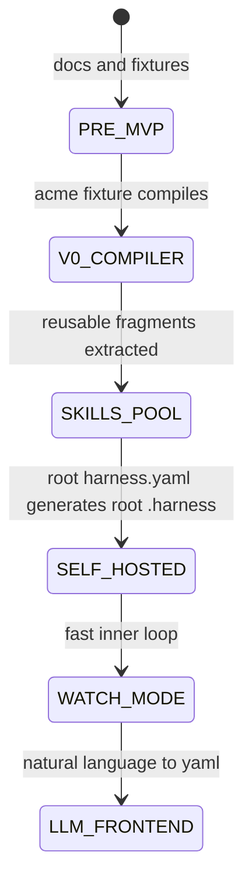

# harness-kit Architecture

## System Overview

harness-kit is a local compiler and content system for project process docs. A user writes or generates `harness.yaml`; the compiler resolves local doc, skill, reference, and permissions fragments; then it emits a deterministic `.harness/` folder into the target project.

## High-Level Architecture

```text
Natural language intent
        |
        | optional LLM frontend
        v
  harness.yaml
        |
        | deterministic compiler
        v
 +---------------------+
 | load -> resolve     |
 |      -> render      |
 |      -> emit        |
 +---------------------+
        |
        v
    .harness/

Local content pools:

docs-pool/        -> parameterized markdown docs
catalog/          -> skill catalog entries
references-pool/  -> raw LLM-readable reference files
permissions       -> small preset emitted to agent settings
```

## Core Flow

```text
User or LLM writes harness.yaml
  -> load: read yaml, parse, validate with zod
  -> resolve: map docs / skills / references to local pool entries
  -> render: eta-render docs and compose derived sections
  -> emit: write files under outDir without deleting unrelated files
```

The first implementation target is `example/nextjs-acme/harness.yaml -> example/nextjs-acme/.harness/` using a subset rule: the compiler only has to byte-match the files it emits, while the hand-filled demo may contain additional docs not yet produced by v0.

## Core Entities

### Harness Manifest

- file: `harness.yaml`
- role: source of truth for one generated harness
- contains: identity, stack, contract, docs, skills, references, and optional permissions preset
- ownership: user-authored or LLM-authored, but always compiled by deterministic code

### Generated Harness

- folder: `.harness/`
- role: project-local documentation and agent operating guide
- ownership: generated artifact once a yaml exists
- edit rule: change yaml, then recompile

### Docs Fragment

- source: `docs-pool/<id>/manifest.ts` and `template.md`
- role: parameterized markdown document
- output: one generated `.md` file under `.harness/`

### Skill Catalog Entry

- source: `catalog/<plugin>/<name>.json` or `catalog/<name>.json`
- role: describe which agent skills should be available and when to invoke them
- output: aggregated skill section and future `SKILLS.md`

### Reference File

- source: `references-pool/<name>.<ext>`
- role: raw, LLM-readable reference material
- output: `.harness/docs/references/<name>.<ext>`

## Compiler API Shape

v0 exposes a programmatic function, not a CLI:

```ts
compile(yamlPath: string, outDir: string): Promise<void>
```

No command name, argv parser, watch mode, check mode, bundling, or package publishing belongs in v0.

## Public Surface

There is no web API and no production service. The public surface for v0 is:

| Surface | Status | Purpose |
|---------|--------|---------|
| `harness.yaml` schema | v0 scope | Authoring contract |
| `compile(yamlPath, outDir)` | v0 scope | Deterministic compile entrypoint |
| `example/nextjs-acme` fixture | v0 scope | Round-trip acceptance target |
| CLI command | deferred | Future developer convenience |
| LLM frontend | deferred | Future yaml authoring helper |

## Determinism Rules

- Do not write timestamps.
- Do not generate random IDs.
- Do not sort with locale-dependent behavior.
- Do not call external services.
- Do not read user home config in the compile path.
- Keep output stable across machines for the same repo content.

## Output Safety

Generated paths are relative to `outDir`. The compiler must reject or normalize any path that would escape `outDir`. The v0 emitter writes files it owns but does not delete stray files.

## Project Lifecycle



## Reliability Semantics

- Invalid yaml fails before fragment resolution.
- Unknown docs, skills, references, or permissions presets fail loudly.
- Render failures include the fragment id and output path where possible.
- Emit failures include the target path.
- The compiler leaves unrelated files in `outDir` untouched.

