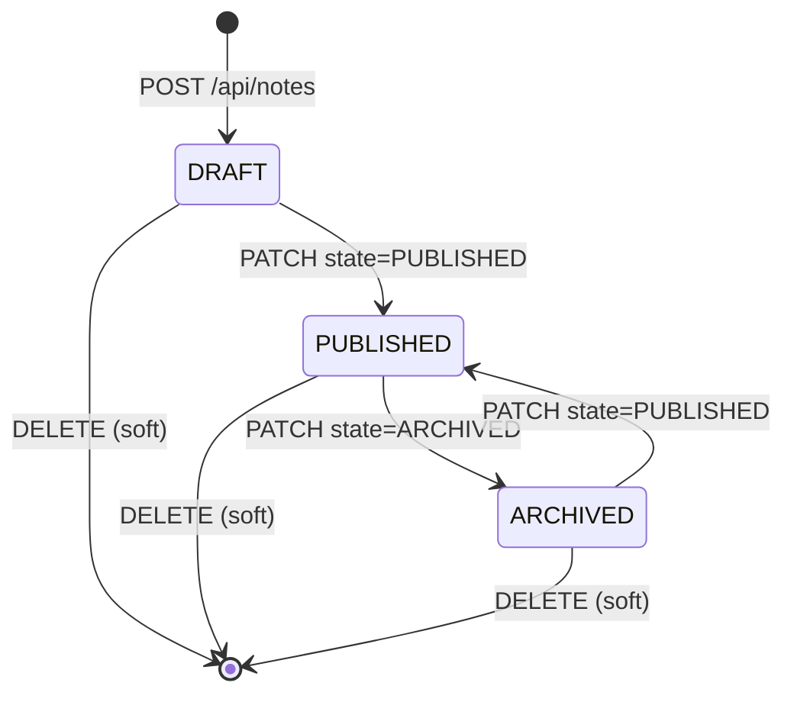

# Acme Notes — Architecture

## System Overview

Acme Notes is a single-user Next.js app. The server renders the authenticated dashboard, exposes a small JSON API under `/api/notes`, and serves published notes at a public read path `/n/{note_id}`. All durable state lives in Postgres.

## High-Level Architecture

```text
+----------+       +----------------------+       +----------+
|  Browser | <---> |  Next.js App Router  | <---> | Postgres |
+----------+       |  (server components, |       |  (Neon)  |
                   |   route handlers,    |       +----------+
+----------+       |   server actions)    |
|  Public  | --->  |                      |
|  reader  |       +----------------------+
+----------+
```

There are no background workers, queues, or external service integrations in V1.

## Core Flow

```text
Owner -> POST /api/notes
  -> validate body with zod
  -> resolve user from session
  -> insert note row (state = 'DRAFT', deleted_at = NULL)
  -> return public note shape

Owner -> PATCH /api/notes/{note_id}
  -> validate body with zod
  -> resolve user from session
  -> UPDATE notes
       SET ... WHERE id = $1 AND user_id = $2 AND deleted_at IS NULL
  -> if 0 rows: 404
  -> if state transition is to PUBLISHED, set published_at

Public reader -> GET /n/{note_id}
  -> SELECT ... WHERE id = $1 AND state = 'PUBLISHED' AND deleted_at IS NULL
  -> if 0 rows: 404
  -> render
```

## Resource Model

### Notes

- public identifier: `note_{ulid}` (e.g. `note_01h8z9bk2xv5r2g0g0e0e0e0e0`)
- tenancy scope: each note carries `user_id`; queries always filter by the resolved session user
- lifecycle states: `DRAFT`, `PUBLISHED`, `ARCHIVED`
- soft delete: a non-null `deleted_at` hides the note from all owner queries and the public reader

### Users

- public identifier: `user_{ulid}` (used internally; never shown to other users in V1)
- managed entirely by Auth.js
- one row per signed-in account

## Public API Shape

| Endpoint | Auth | Purpose |
|----------|------|---------|
| `GET /api/notes` | session cookie | List the calling user's non-deleted notes |
| `POST /api/notes` | session cookie | Create a `DRAFT` note |
| `GET /api/notes/{note_id}` | session cookie | Read one owned note |
| `PATCH /api/notes/{note_id}` | session cookie | Update title, body, or state of an owned note |
| `DELETE /api/notes/{note_id}` | session cookie | Soft-delete an owned note |
| `GET /n/{note_id}` | none | Public read for `PUBLISHED` non-deleted notes only |

## Internal Management Interfaces

None in V1. The authenticated dashboard uses the public `/api/notes` routes directly (no separate internal surface). If admin tooling is added later it will live under `/api/admin/...` and is explicitly out of contract for V1.

## Request Lifecycle



Notes:

- `DRAFT → ARCHIVED` is not allowed; archive only `PUBLISHED` notes (UI hides the option).
- A soft-deleted note can be undeleted by clearing `deleted_at`, but the V1 UI does not expose this.

## Tenant Boundary

Single-user per account, no organizations. Every query on `notes` filters by `user_id` resolved from the session. There is no client-supplied tenant parameter on any route.

## Reliability Semantics

- Duplicate-create rule: same user + same title + same body within 5 seconds returns `409` with the existing `note_id`.
- Transition safety: all state changes use `UPDATE ... WHERE id = $1 AND user_id = $2 AND deleted_at IS NULL`. If zero rows are returned, respond with `404`.
- The public read path explicitly re-checks `state = 'PUBLISHED' AND deleted_at IS NULL`. It does not trust any cache that may be ahead of the database.

## Data Stored for Outcomes

A note row exposes (publicly) only:

- `id`
- `state`
- `title`
- `body`
- `created_at`
- `updated_at`
- `published_at` (null until first publish)

Soft-delete metadata (`deleted_at`), the owner `user_id`, and any future analytics fields are never exposed through the public API.
