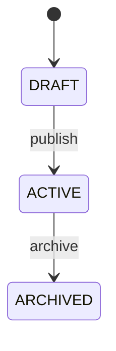

# Architecture

## System Overview

One paragraph describing the system's job in plain language. Say what *kind* of system this is (web app, relay, internal tool, marketplace, etc.), who its callers are, and what its primary data is.

## High-Level Architecture

Replace the ASCII below with a diagram that fits your system. The shape matters more than the boxes.

```text
+----------+      +----------------------+      +----------+
|  Client  | ---> |  Next.js App Router  | ---> |  Postgres|
+----------+      |  (server + route     |      +----------+
                  |   handlers)          |
+----------+      |                      |      +----------+
| External | <--> |                      | <--> | External |
| service  |      +----------------------+      | service  |
+----------+                                    +----------+
```

## Core Flow

Walk through the happy path of the single most important user action, end to end. Use a short pseudo-code style:

```text
Client -> POST /api/<resource>
  -> validate input
  -> auth check
  -> persist
  -> trigger side effects
  -> return canonical response
```

Document any non-obvious flow (background work, retries, idempotency, fan-out) in its own subsection.

## Resource Model

For each public resource, document:

- public identifier format (e.g. `note_{ulid}`)
- tenancy scope (which keys constrain visibility)
- authentication / authorization model
- core lifecycle states, if any

Keep this list short. Big enumerations belong in `docs/design-docs/`.

## Public API Shape

Tabulate the routes that callers depend on. List auth method per route. Internal-only routes belong in a separate "Internal Interfaces" section so they cannot accidentally be treated as contract.

| Endpoint | Auth | Purpose |
|----------|------|---------|
| `GET /api/<resource>` | session | List the calling user's items |
| `POST /api/<resource>` | session | Create an item |
| `GET /api/<resource>/{id}` | session | Read one item |
| `PATCH /api/<resource>/{id}` | session | Update one item |
| `DELETE /api/<resource>/{id}` | session | Delete one item |

## Internal Management Interfaces

List internal-only routes that the management UI relies on but that callers must never depend on. State explicitly that these are not part of the public contract.

## Request Lifecycle

If your resource has a lifecycle (states, transitions), document the diagram here. Otherwise delete this section.



## Tenant Boundary

State the tenancy boundary explicitly even for single-tenant projects (write "single-user, no multi-tenancy"). For multi-tenant systems, name the boundary entity, where it is resolved, and which routes are allowed to accept tenant selectors from clients vs deriving them server-side.

## Reliability Semantics

Summarize the failure-handling behavior callers can rely on. Detailed rationale lives in `RELIABILITY.md`.

- duplicate-request rule
- failure-state rule (terminal vs retryable)
- timeout rule
- race-safety guarantees

## Data Stored for Outcomes

If callers can read execution results, list exactly which fields are exposed. Keep this list minimal — the smaller the surface, the easier it is to keep stable.
